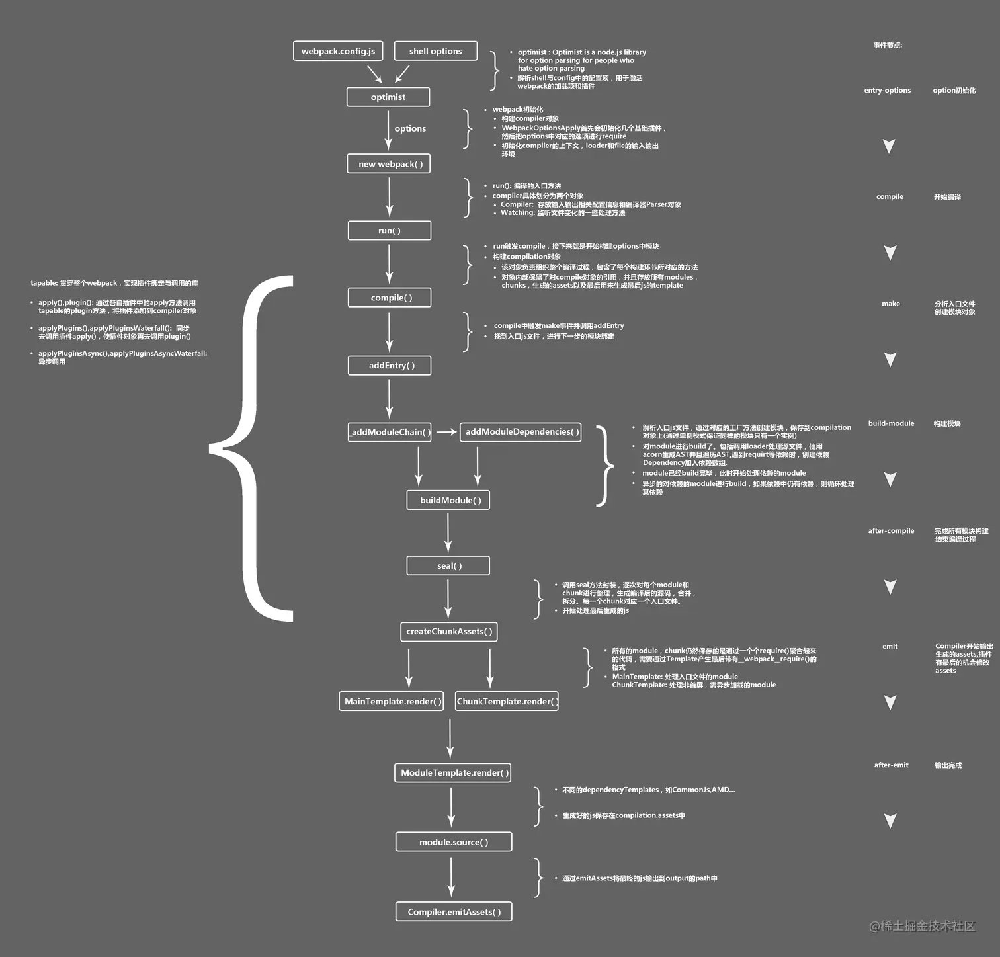

[TOC]

## JavaScript


## React

> react 相关内容: hooks
>
> 官方文档：https://react.dev/
>
> 中文文档：https://zh-hans.react.dev/

### 创建项目

> `npx create-react-app my-app`

### Next.js

> Nextjs是一个基于React构建的轻量级框架，用于构建静态和服务端渲染的应用程序。
>
> 官方文档: https://nextjs.org/
>
> 中文文档: https://www.nextjs.cn/

#### 创建项目

```bash
npx create-next-app@latest --typescript
```

#### getServerSideProps

> 页面中的`API`，执行环境为`node`端。
>
> 配置后切换<font color='blue'>**SSR**</font>渲染模式

```typescript
import { GetServerSideProps } from 'next';
export const getServerSideProps: GetServerSideProps = async context => {
    return {
        props: {}
    };
};
```

其中context参数包含常用请求的`req`、`res`、`params`、`query`等参数，还包含`preview`、`previewData`、`resolvedUrl`、`locale`等参数。

### hooks

> hooks 设计目的：增强函数式组件，完全不使用"类"。
>
> PS: 组件尽可能写成纯函数，如果需要外部功能和副作用，就用**钩子**把外部代码"钩"进来。
>
> `import {useXxx} from 'react';`

#### useState(): 状态钩子

> `useState()`用于为函数组件引入状态state。纯函数不能有状态，所以把状态放在钩子中。

```react
/* useSate 函数接受状态的初始值作为参数；返回一个数组，第一个元素是变量指向状态的当前值、第二个参数是函数更新状态 */
const [state, setState] = useState('');
```

#### useContext(): 共享状态钩子

> `useContext()`用于在组件之间共享状态。
>
> PS: 通常配合`React.createContext()`使用。

```react
const AppContext = React.createContext({});


<AppContext.Provider value={{
  username: 'superawesome'
}}>
  <div className="App">
    <Navbar/>
    <Messages/>
  </div>
</AppContext.Provider>

const Navbar = () => {
  const { username } = useContext(AppContext);
  return (
    <div className="navbar">
      <p>AwesomeSite</p>
      <p>{username}</p>
    </div>
  );
}
```


## React-Native

> react native相关内容
>
> 官方文档: https://reactnative.dev/
>
> 中文文档: https://reactnative.cn/

### ScrollView

> [滚动视图](https://reactnative.dev/docs/scrollview)
>
> **提供高度**、**全部渲染**

方法:

- *scrollTo*: 滚动到指定的 x, y 偏移处。第三个参数为是否启用平滑滚动动画；

  ```typescript
  scrollTo(
    options?: {x?: number, y?: number, animated?: boolean} | number,
    deprecatedX?: number,
    deprecatedAnimated?: boolean,
  );
  ```

- *scrollToEnd*: 滚动至滚动视图最底部（水平则滚动至最右边）；

  ```typescript
  scrollToEnd(([options]: {animated: boolean, duration: number}));
  ```

- *FlashScrolldicators*: 短暂显示滚动指示器；

### FlatList

> [高性能列表组件](https://reactnative.dev/docs/flatlist)

属性：

- *ItemSepararComponent*: 列表Item中间隔组件；（`component`, `function`, `element`）
- *ListEmptyComponent*: 列表为空时渲染组件；（`component`, `function`, `element`）


## Vue


## 第三方Module

### immutable

> 不可变数据结构
>
> 原理: `Persistent Data Structure`持久化数据结构，使用旧数据创建新数据时，保证旧数据同时可用且不变。


## webpack

> 模块打包器
>
> 官方文档: https://webpack.js.org/
>
> 中文文档：https://webpack.docschina.org/

webpack是一个用于现代JavaScript应用程序的 *静态模块打包工具*

- ***静态***: 项目中静态资源如CSS、图片等文件；
- ***模块***: js文件（模块化开发中，一切js文件皆为模块）；
- ***打包***: 压缩代码，进行混淆加密（多文件）

作用: 分析、压缩、打包代码；

优点: 减少文件体积，减少文件数量；提高网页加载速度。

### 原理流程

> webpack的构建流程分为三大阶段：
>
> 1. 初始化: 启动构建，读取与合并配置参数，加载 Plugin，实例化 Compiler;
> 2. 编译: 从 Entry 发出，针对每个 Module 串行调用对应的 Loader 去翻译文件内容，再找到该 Module 依赖的 Module，递归地进行编译处理;
> 3. 输出: 对编译后的 Module 组合成 Chunk，把 Chunk 转换成文件，输出到文件系统。
>
> 参考：https://juejin.cn/post/7104936845682671630#heading-11



### 使用

> webpack是node环境中的工具类模块，基于nodejs。

1. *安装*: `npm i webpack webpack-cli -D`;
   -D表示开发阶段；本地包兼容项目情况，不建议全局安装。
2. *检查*: `npx webpack -v`;
   检查node_modules中是否存在webpack，有则输出其版本信息
3. *打包*: `npx webpack js路径`;
   默认打包 `./src/index.js`

### 配置文件

> 配置文件名`webpack.config.js`
>
> 默认导出项`module.exports`

- *entry*: <font color="red">**入口**</font>，默认 `./src/main.js` ，支持多入口;（<font color="blue">**相对路径**</font>）

- *output*: <font color="red">**输出**</font>，主要输出文件默认 `./dist/main.js` ，其余生成文件默认放置 `./dist` 文件夹中;（[参考][https://webpack.docschina.org/configuration/output/]）

  - *path*: 所有文件输出名称;（<font color="blue">**绝对路径**</font>）
  - *filename*: 入口文件打包输出的名称;（列在 `entry` 中，打包后输出的文件的名称）
  - *chunkFilename*: 其他文件打包输出的名称;（未列在 `entry` 中，却又需要被打包出来的文件的名称，eg: 懒加载代码）
  - *assetModuleFilename*: 资源模块打包输出的文件名格式;
  - *clean*: 是否自动清空上次打包内容;

- *module*: <font color="red">**加载器**</font>，解析与处理模块，用于处理非`.js`模块，协助打包处理特定的文件模块;（[参考][https://webpack.docschina.org/configuration/module/]）
  规则分为三部分: **条件**、**结果**和**嵌套规则**; **条件**: test、include、exclude和resource、issuer匹配; **结果**: 使用loader数组处理模块; 使用parser为模块创建解析器; **嵌套规则**: 使用属性 [`rules`](https://webpack.docschina.org/configuration/module/#rulerules) 和 [`oneOf`](https://webpack.docschina.org/configuration/module/#ruleoneof) 指定嵌套规则，解析顺序-父规则、rules、oneOf。

  - *rules*: 数组，条件匹配规则，匹配模块并进行相应解析处理，其中元素为对象;（loader处理顺序是从后向前）

    - *test*: 正则表达式或正则表达式数组，被匹配的模块会被use中loader处理;

    - *use*: 字符串、对象或数组，表示要使用的loader;

    - *loader*: use使用特例，指定一个loader处理模块;

    - *exclude*: 绝对路径字符串或正则表达式，不处理匹配的模块;

    - *include*: 同exclude，只处理匹配的模块;

    - *parser*: 解析选项对象;（场景：代码转换、依赖分析、性能优化）

      ```json
      {
       	amd: false, // 禁用 AMD
        commonjs: false, // 禁用 CommonJS
        system: false, // 禁用 SystemJS
        harmony: false, // 禁用 ES2015 Harmony import/export
        requireInclude: false, // 禁用 require.include
        requireEnsure: false, // 禁用 require.ensure
        requireContext: false, // 禁用 require.context
        browserify: false, // 禁用特殊处理的 browserify bundle
        requireJs: false, // 禁用 requirejs.*
        node: false, // 禁用 __dirname, __filename, module, require.extensions, require.main, 等。
        commonjsMagicComments: false, // 禁用对 CommonJS 的  magic comments 支持
        node: {}, // 在模块级别(module level)上重新配置 node 层(layer)
        worker: ['default from web-worker', '...'], // 自定义 WebWorker 对 JavaScript 的处理，其中 "..." 为默认值。
      }
      ```

    - *enforce*: `'pre'|'post'`，'pre'表示这个loader最先执行，'post'表示这个loader最后执行;

    - *resource & issuer*: 被加载的模块为`resource`，实施加载的模块为`issuer`;
      默认配置resource，指定被加载模块的处理；issuer指定实施加载模块下匹配模块的loader处理

    - *type*: `'javascript/auto' | 'javascript/dynamic' | 'javascript/esm' | 'json' | 'webassembly/sync' | 'webassembly/async' | 'asset' | 'asset/source' | 'asset/resource' | 'asset/inline'`，用于指定模块的类型;

    - *oneOf*: 规则rule数组，只使用第一个匹配的规则，优化性能;

    - ......

- *resolve*: 解析，配置模块如何解析;

  - *alias*: map对象，创建导入的别名，简化引入模块路径;
  - *extensions*: 后缀名数组，按顺序解析这些后缀名
  - ......

- *optimization*: 优化配置项;

  - *splitChunks*: 代码分割配置;
  - *minimize*: 是否压缩代码;
  - ......

- *plugins*: 插件，用于以各种方式自定义 webpack 构建过程，解决打包的自动化工作;

- *mode*: `none'|'development'|'production'`，webpack使用相应模式内置优化;

  | 选项          | 描述                                                         |
  | ------------- | ------------------------------------------------------------ |
  | `development` | 会将 `DefinePlugin` 中 `process.env.NODE_ENV` 的值设置为 `development`. 为模块和 chunk 启用有效的名。 |
  | `production`  | 会将 `DefinePlugin` 中 `process.env.NODE_ENV` 的值设置为 `production`。为模块和 chunk 启用确定性的混淆名称，`FlagDependencyUsagePlugin`，`FlagIncludedChunksPlugin`，`ModuleConcatenationPlugin`，`NoEmitOnErrorsPlugin` 和 `TerserPlugin` 。 |
  | `none`        | 不使用任何默认优化选项                                       |

- *devServer*: 开发服务器，监视源代码修改；不会输出资源，在内存中编译打包;

  ```json
  {
    host: "localhost",  // 启动服务器域名
    port: "3000",   // 启动服务器端口号
    open: true, // 是否自动打开浏览器
    hot: true, // 关闭HMR
  }
  ```

- *cache*: 缓存生成的 webpack 模块和 chunk，来改善构建速度;

- *devtool*: 控制是否生成，以及如何生成 source map;

```javascript
const os = require("os");
const path = require("path");   // nodejs核心模块，专门来处理路径问题
const ESLintPlugin = require("eslint-webpack-plugin");
const HtmlWebpackPlugin = require("html-webpack-plugin");
const MiniCssExtractPlugin = require("mini-css-extract-plugin");
// const ImageMinimizerPlugin = require("image-minimizer-webpack-plugin");

const threads = os.cpus().length;

/**
 * 针对js兼容性处理，使用Babel来完成；
 * 针对代码格式，使用Eslint来完成；
 * 先完成Eslint，检测代码格式无误之后，再使用Babel做代码兼容性处理。 
 */
module.exports = {
    // 入口（相对路径）
    entry: './src/main.js',
    // 输出
    output: {
        // 所有文件的输出名称（绝对路径）
        // __dirname nodejs的变量，代表当前文件的文件夹目录
        // 开发模式没有输出
        path: undefined,
        // 入口文件打包输出文件名
        filename: 'static/js/[name].js',
        // 给打包输出的其他文件命名
        chunkFilename: 'static/js/[name].chunk.js',
        // 图片、字体通过type:asset处理资源命名
        assetModuleFilename: "static/media/[name].[hash:7][ext][query]",
        // 自动清空上次打包的内容
        // 原理：在打包前，将path整个目录内容清空，再进行打包
        // clean: true,
        // 可以将type为asset资源保存路径改变，优先级没有在loader中设置高
        // assetModuleFilename: '/static/images/[name].[hash:7][ext][query]'
    },
    // 加载器
    module: { 
        rules: [
            // loader的配置
            {
                // 每个文件只能被其中一个loader配置处理
                oneOf: [
                    {
                        test: /\.css$/,    // 正则匹配.css结尾文件
                        use: [  // 执行顺序，从右到左（从下到上）
                            MiniCssExtractPlugin.loader,    // 提取css成单独文件
                            // "style-loader", // 将js中css通过创建style标签添加到html文件中生效
                            "css-loader",   // 将css资源编译成commonjs的模块到js中
                        ],
                    },
                    // less资源
                    {
                        test: /\.less$/,
                        // loader: "",  // 只能使用1个loader
                        use: [
                            // 使用多个loader
                            MiniCssExtractPlugin.loader,    // 提取css成单独文件
                            // "style-loader",
                            "css-loader",
                            "less-loader",  // 将less编译成css文件
                        ],
                    },
                    // sass资源
                    {
                        test: /\.s[ac]ss$/,
                        use: [
                            MiniCssExtractPlugin.loader,    // 提取css成单独文件
                            // "style-loader",
                            "css-loader",
                            "sass-loader",  // 将sass编译成css文件
                        ]
                    },
                    // stylus资源
                    {
                        test: /\.styl$/,
                        use: [
                            MiniCssExtractPlugin.loader,    // 提取css成单独文件
                            // "style-loader",
                            "css-loader",
                            "stylus-loader",    // 将stylus编译成css文件
                        ]
                    },
                    // 图片资源
                    {
                        test: /\.(png|jpe?g|gif|webp)$/,
                        // type: "asset"|"asset/resource"|"asset/inline"|"asset/source"
                        /**
                         * "asset" : 在导出一个 data URI 和发送一个单独的文件之间自动选择。之前通过使用 url-loader，并且配置资源体积限制实现。
                         * "asset/resource" : 发送一个单独的文件并导出 URL。之前通过使用 file-loader 实现。
                         * "asset/inline" : 导出一个资源的 data URI。之前通过使用 url-loader 实现。
                         * "asset/source" : 导出资源的源代码。之前通过使用 raw-loader 实现。
                         */
                        type: "asset",
                        // 转换为base64添加·
                        parser: {
                            dataUrlCondition: {
                                // 小于8KB的图片转base64
                                // 优点：减少请求数量
                                maxSize: 8 * 1024,  // 8KB
                            },
                        },
                        // generator: {
                        //     // 输出图片名称
                        //     // hash:7 代表输出名称只有7位;name为原来文件名
                        //     filename: "static/imgs/[name].[hash:7][ext][query]",
                        // }
                    },
                    // 字体图标资源及其他资源
                    {
                        test: /\.(ttf|woff2?|mp3|mp4|avi)$/,
                        type: "asset/resource",
                        // generator: {
                        //     // 输出图片名称
                        //     filename: "static/media/[name].[hash:7][ext][query]",
                        // }
                    },
                    // babel配置
                    {
                        test: /\.js$/,
                        // exclude: /node_modules/,   // 排除node_module文件不处理
                        include: path.resolve(__dirname, '../src'), // 只处理src文件夹下的文件，其他不处理
                        use: [
                            {
                                loader: "thread-loader",    // 开启多进程
                                options: {
                                    works: threads, // 进程数量
                                }
                            },
                            {
                                loader: "babel-loader",
                                // 内部配置
                                options: {
                                    // presets: ["@babel/preset-env"],
                                    cacheDirectory: true,   // 开启babel缓存
                                    cacheCompression: false,    // 关闭缓存文件压缩
                                    plugins: ["@babel/plugin-transform-runtime"],    // 减少代码体积
                                }
                            }
                        ]
                    }
                ]
        }
        ]
    },
    // 插件
    plugins: [
        // plugins的配置
        // 需要创建eslintrc配置文件
        new ESLintPlugin({
            // 检测哪些文件
            context: path.resolve(__dirname, "../src"),
            exclude: "node_modules",    // 默认值
            cache: true,    // 开启缓存
            cacheLocation: path.resolve(__dirname, "../node_modules/.cache/eslintcache"),
            threads,    // 开启多进程和设置多进程数量
        }),
        new HtmlWebpackPlugin({
            // 模板：以public/index.html文件创建新的html文件
            // 新的文件特点：1、结构和原来一致；2、会自动引入打包输出的资源
            template: path.resolve(__dirname, "../public/index.html"),
        }),
        new MiniCssExtractPlugin()
    ],
    
    optimization: {
        // 压缩图片
        /* minimizer: [
            new ImageMinimizerPlugin({
                minimizer: {
                    implementation: ImageMinimizerPlugin.imageminGenerate,
                    options: {
                        plugins: [
                            ["gifsicle", { interlaced: true }],
                            ["jpegtran", { progressive: true }],
                            ["optipng", { optimizationLevel: 5 }],
                            [
                                "svgo",
                                {
                                    plugins: [
                                        "preset-default",
                                        "prefixIds",
                                        {
                                            name: "sortAttrs",
                                            params: {
                                                xmlnsOrder: "alphabetical",
                                            },
                                        },
                                    ],
                                },
                            ],
                        ],
                    },
                }
                
            }),
        ], */
        // 代码分割配置
        splitChunks: {
            chunks: "all",
            // 其他都用默认值
        }
    },
    
    // 开发服务器，监视源代码修改；不会输出资源，在内存中编译打包的
    devServer: {
        host: "localhost",  // 启动服务器域名
        port: "3000",   // 启动服务器端口号
        open: true, // 是否自动打开浏览器
        hot: true, // 关闭HMR
    },
    // 模式
    mode: 'development',
    devtool: "cheap-module-source-map",
}
```


## babel


## NPM

TODO: https://cloud.tencent.com/developer/section/1490263


## Others

### WebSocket

> WebSocket是基于TCP的一种新的应用层网络协议。实现浏览器与服务器全双工通信，即允许服务器主动发送信息给客户端。
>
> *一次握手、持久连接、双向数据传输*

为实现实时通信，比较常用的是 ajax 轮询，即特定时间间隔由浏览器发出请求，服务器返回最新的数据，存在以下问题:

- HTTP 请求的头部信息较多，有效数据占比较小，导致带宽浪费;
- 服务器被动接收浏览器的请求然后响应，数据没有更新时仍然要接收并处理请求，导致服务器CPU占用;

WebSocket 优点:

- WebSocket 头部信息少，通常只有 2Bytes左右，节省带宽;
- WebSocket 支持服务端主动推动信息，更好支持实时通信;


### CSR & SSR & SSG

> CSR、SSR、SSG为目前主流的前端页面渲染方式。
>
> 参考：https://juejin.cn/post/7039151040188383268#heading-4

#### CSR

> Client Side Rendering，代表客户端渲染，浏览器先下载html文档，然后再下载js来执行渲染出页面结果

优点:

- 前后端分离;
- 服务器压力变轻，渲染工作在客户端进行，服务器直接返回不加工的html;
- 用户在后续访问操作体验好，（首屏渲染慢）可以讲网站做成SPA，进行增量渲染;

缺点:

- 不利于SEO，因为搜索引擎不执行JS相关操作，无法获取渲染后的最终html;
- 首屏渲染时间比较长，因为需要页面执行ajax获取数据来渲染页面，如果请求接口多，不利于首屏渲染;
